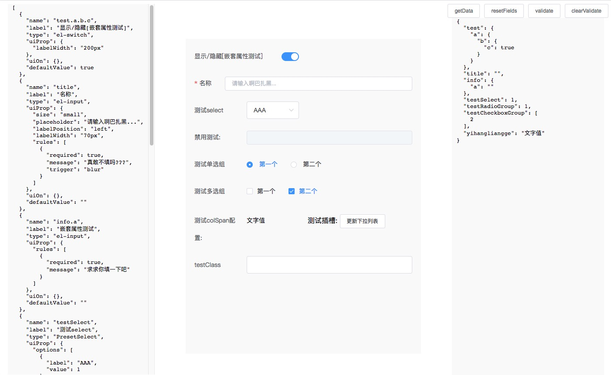

# form-render-vue
> json 生成表单



Todo:
- [x] 嵌套属性绑定数据
- [x] 不同type生成不同表单元素
- [x] 表单元素绑定props和events
- [x] 条件判断元素显示隐藏
- [x] 表单元素宽度设置
- [x] 单个表单元素改变, 触发 `on-${name}-change`事件

### Quick Start

1. 安装

使用分支名或者标签名, 如: `#master`, `v1.0.1`

```
npm i git+http://192.168.3.208/houjiaqi/form-render-vue.git#master --save
```

2. 使用

```javascript
import FormRender from '@/components/FormRender/index.vue'
export default {
  components: {
      FormRender
  }
}
```

```html
<form-render
  ref="form"
  :formProps="{
    labelPosition: 'left',
    labelWidth: '120px'
  }"
  :fields="testData"
  :formModel="model"
>
  <template slot="getListButton">
    <div class="vertical-align-center">
      <span>
        测试插槽:
      </span>
      <el-button size="small" @click="updateConfig">更新下拉列表</el-button>
    </div>
  </template>
</form-render>
```

### Doc

#### Props

| prop | 类型 | 默认值 | 描述
| :- | :- | :- | :-
| formProps | object | {} | El-Form的[props配置项](https://element.eleme.cn/#/zh-CN/component/form#form-attributes)
| fields | array | [] | 用于生成表单的json array
| fields[n] | object | - | 单个表单元素的配置对象, 详见下表
| formModel | object | {} | 表单绑定的数据对象


##### JSON schema元素

| Fields Item Key | 类型 | 例子 | 描述
| :- | :- | :- | :-
| name | string | 'name.firstName' | 绑定在表单数据上的key, 必须唯一
| label | string | '姓名' | 表单元素的标签文本
| type | string | 'input' | 表单元素类型, input/switch/select/checkbox-group/radio-group等element支持的类型, 以及 text
| defaultValue | any | '张三' | 默认值
| slot | string | 'submitBtn' | 设置此表单元素为插槽类型, 值为插槽名, 使用方式如上述Quick start所示
| uiProp | object | {} | 传递给表单元素的props, 具体参考element每个表单元素的props(有特殊情况, 在下面说明)
| uiOn | object | {} | 对表单元素绑定的事件, (val: 事件传递的值, schema: 即fields, model: 表单数据对象, event: 原始事件对象, 可能为空) => void; 
| uiHide | (model) => boolean | 当前表单元素是否隐藏, 参数为表单数据对象
| colSpan | number | 12 | 此表单项占据的列数, 最大且默认24
| className | string | 'active-item' | 表单样式class


fields示例
```javascript
{
  name: 'title',
  label: '名称',
  type: 'input',
  defaultValue: '',
  uiProp: {
    size: 'small',
    placeholder: '写个名字吧',
    labelPosition: 'left',
    labelWidth: '70px',
    rules: [
      {
        required: true,
        message: '请输入名字',
        trigger: 'blur'
      }
    ]
  },
  uiOn: {
    change (val, schema, model, event) {
      // this: FormRender vm instance
      console.log({ val, schema, model, event }, '来自配置json的log')
      const config = schema.find(s => s.name === 'title')
      this.$set(config, 'label', val + '名称')
      // config.label = val + '名称'
    }
  }
}
```

> 下面是特殊情况
###### Select
select的配置项里多一个options选项, 即每个select option, 如下

```javascript
{
  name: 'testSelect',
  label: '测试select',
  type: 'select',
  defaultValue: 1,
  uiProp: {
    options: [
      { label: 'AAA', value: 1 },
      { label: 'BBB', value: 2, disabled: true }
    ]
  },
  uiOn: {},
  colSpan: 12 // 1-24
}
```


#### Events

##### on-${field.name}-change
val: 事件传递的值, schema: 即fields, model: 表单数据对象, event: 原始事件对象
| 参数 | 描述
| :- | :-
| val | change值
| schema | jsonSchema, 即fields
| model | 表单数据对象 


特殊标签
- text 直接就文字!😄

## Project setup
```
npm install
```

### Compiles and hot-reloads for development
```
npm run serve
```

### Compiles and minifies for production
```
npm run build
```

### Lints and fixes files
```
npm run lint
```

### Customize configuration
See [Configuration Reference](https://cli.vuejs.org/config/).
